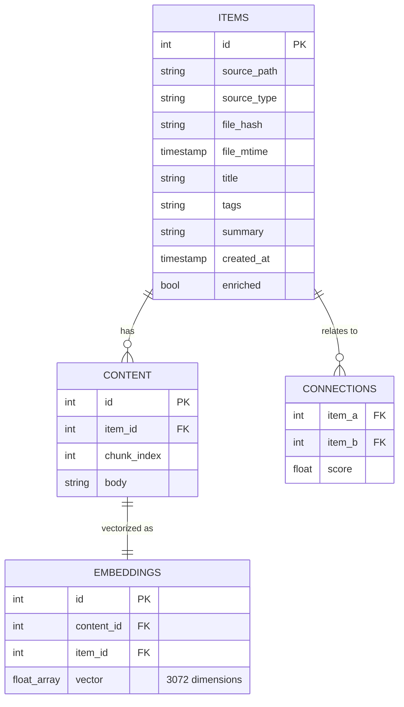

# Black Vault — Technical Documentation

Black Vault is designed as a local-first, intelligence-augmented file storage system. This document explains the internal mechanics of the MVP and recent feature additions.

## 1. Architecture Overview

Black Vault uses a strictly decoupled **Two-Layer Architecture**:

### Interface Layer (`src/cli.py`)
- **Responsibility**: User interaction, command parsing, and result formatting.
- **Tech**: Built with `typer` (CLI structure) and `rich` (UI formatting/tables).
- **Decoupling**: It never connects to DuckDB directly. It interacts purely with the `backend` package. This allows future ports to Tauri (GUI) or a FastAPI wrapper without changing the core processor.

### Processor Layer (`src/backend/`)
- **Responsibility**: The "brain" of the application. Handles ingestion, vectorization, enrichment, searching, and note consolidation.
- **Components**:
  - `ingest.py`: Manages the data pipeline (chunking, embeddings, avoiding duplicates).
  - `db.py`: Abstracted data access layer using DuckDB.
  - `search.py`: Hybrid ranking engine.
  - `enrich.py`: Local semantic augmentation (Ollama / LLMs).
  - `connections.py`: Relationship discovery engine.
  - `log.py`: Persistent logging toggle logic.
  - `pdf.py`: PDF text extraction logic.
  - `ocr.py`: Optical Character Recognition for images (using EasyOCR).
  - `stt.py`: Speech-To-Text pipeline for audio files (using `ffmpeg`).
  - `consolidate.py`: Algorithmic semantic grouping and LLM-assisted merging of small notes.

### Testing Layer (`tests/`)
- **Responsibility**: Validation, integration, and benchmarking. Includes tests for chunking, ingestion, easyOCR accuracy, PDF reading, STT processing, and note consolidation.

---

## 2. Ingestion Pipeline

When a file is "dropped" into the vault:

1. **Hash & Deduplication Check**: The `ingest.py` module calculates an MD5 hash of the file. If that exact hash is already in the database, the ingestion is skipped (raising a `DuplicateError`) to preserve system resources.
2. **Detection & Extraction**: 
   - Uses the `mimetypes` library with custom fallbacks to detect MIME type.
   - **Text (`text/*`)**: Read as UTF-8.
   - **PDF (`application/pdf`)**: Text extracted via `pdf.py`.
   - **Image (`image/*`)**: Text extracted via `ocr.py` running **EasyOCR**.
   - **Audio (`audio/*`)**: Audio converted via `ffmpeg` into compliant format, then transcribed with `stt.py`.
   - **YouTube URLs**: Fetches transcript via `youtube.py` directly.
3. **Chunking**: `RecursiveCharacterTextSplitter` from LangChain breaks the text into 500-character segments with 100-character overlap to preserve context at the boundaries.
4. **Vectorization**: The `google-genai` SDK sends chunks to `gemini-embedding-001`. Each chunk returns a **3072-dimension** vector.
5. **Atomic Storage**: The item metadata, text chunks, and vector embeddings are stored using DuckDB.

---

## 3. Data Model (DuckDB)

Black Vault persists everything in a single `.duckdb` file utilizing `vss` and `fts` extensions.

---

## 4. Hybrid Search Engine

Black Vault performs **Hybrid Search** by combining two distinct scoring strategies:

### Semantic Ranking (70% weight)
Uses the **DuckDB-VSS** extension to perform an HNSW (Hierarchical Navigable Small World) vector search.
- **Distance Metric**: Cosine Similarity.
- **Precision**: Handles conceptual matches (e.g., search "programación" finds files about "Python").

### Lexical Ranking (30% weight)
Uses the **DuckDB-FTS** extension to perform BM25 (Best Matching 25) ranking across text chunks.
- **Precision**: Handles specific terms, names, or IDs that embeddings might overlook using probabilistic relevance.

### Fusion
Results are combined and deduplicated at the `item_id` level. A final weighted score is computed, and the system returns the top-ranked unique items.

---

## 5. Intelligence Pipeline & Background Processes

After ingestion, or optionally invoked via CLI, the system triggers subsequent intelligence processes:

### Enrichment (`enrich.py`)
Calls a local Ollama instance running `llama3.2` via HTTP. The model processes each chunk and returns a structured JSON metadata block for each. Finally, the system aggregates these to establish:
- A human-readable **Title**.
- Relevant **Tags** for filtering.
- A concise **Summary**.

### Note Consolidation (`consolidate.py`)
An automated mechanism to keep the vault clean from isolated, small note fragments.
- **Semantic Clustering**: Queries items containing a small string length (e.g., <300 chars). It extracts the embeddings of these items and calculates mutual Cosine Similarities via Euclidean math. Nodes mathematically mapping closer than `0.70` cosine similarity are clustered together.
- **LLM Merging**: Clusters consisting of 2+ items are dispatched to the `gemini-2.5-flash` LLM. The LLM processes all fragmented texts and orchestrates them into a single coherent paragraph, complete with a generated Title.
- **Garbage Collection**: The original fragmented notes are subsequently deleted, and the new consolidated Markdown block is dynamically ingested into the Vault.

### Operations Tracking (`log.py`)
- Provides a persistent file logging mechanism. 
- When enabled via `logtoggle` command, all CLI activities are timestamped and recorded locally.

### Relationship Discovery (`connections.py`)
- Computes a **Mean Embedding** for the entire document (averaging its chunks).
- Compares it against all other Mean Embeddings in the vault using Cosine Similarity.
- If similarity > **0.75**, a connection is recorded. This powers the "See related items" feature without manual linking.
