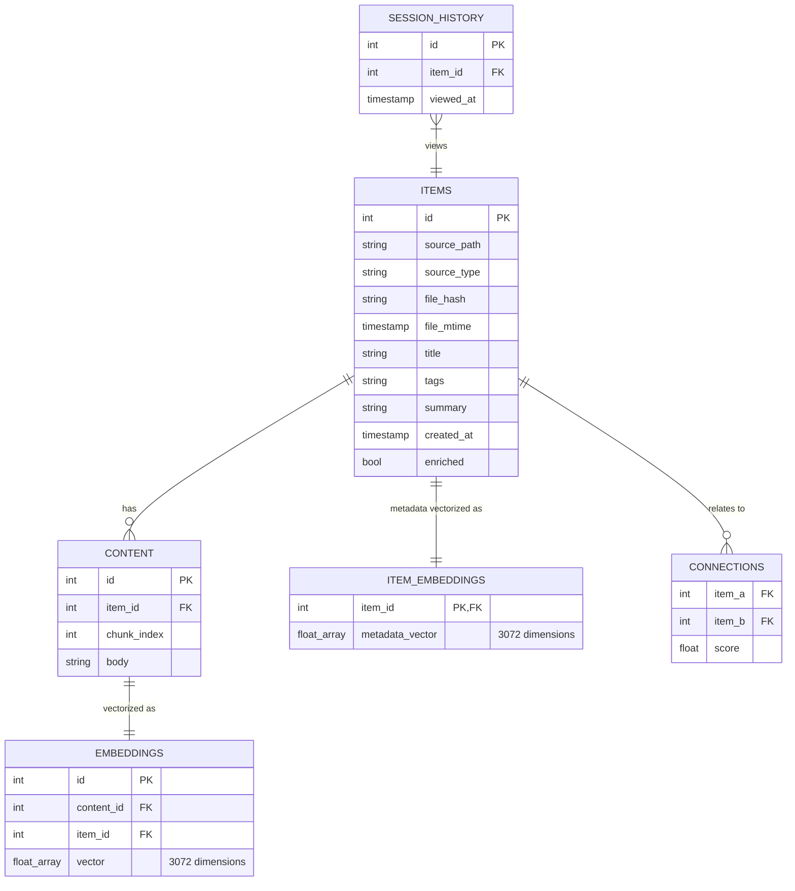

# Black Vault — Technical Documentation

Black Vault is designed as a local-first, intelligence-augmented file storage system. This document explains the internal mechanics of the MVP and recent feature additions.

## 1. Architecture Overview

Black Vault uses a strictly decoupled **Two-Layer Architecture**:

### Interface Layer (`src/cli.py`)
- **Responsibility**: User interaction, command parsing, and result formatting.
- **Tech**: Built with `typer` (CLI structure) and `rich` (UI formatting/tables).
- **Decoupling**: It never connects to DuckDB directly. It interacts purely with the `backend` package. This allows future ports to Tauri (GUI) or a FastAPI wrapper without changing the core processor.

### Processor Layer (`src/backend/`)
- **Responsibility**: The "brain" of the application. Handles ingestion, vectorization, enrichment, intent parsing, searching, and note consolidation.
- **Components**:
  - `ingest.py`: Manages the data pipeline (chunking, embeddings, avoiding duplicates).
  - `intent.py`: LLM-powered query intent routing and parameter extraction (Pydantic-based).
  - `db.py`: Abstracted data access layer using DuckDB.
  - `search.py`: Tri-hybrid ranking engine (Semantic, Lexical, and Metadata).
  - `enrich.py`: Local semantic augmentation computing metadata and `item_embeddings`.
  - `connections.py`: Relationship discovery engine.
  - `log.py`: Persistent logging toggle logic.
  - `pdf.py`: PDF text extraction logic.
  - `ocr.py`: Optical Character Recognition for images (using EasyOCR).
  - `stt.py`: Speech-To-Text pipeline for audio files (using `ffmpeg`).
  - `consolidate.py`: Algorithmic semantic grouping and LLM-assisted merging of small notes.

### Testing Layer (`tests/`)
- **Responsibility**: Validation, integration, and benchmarking. Includes tests for chunking, ingestion, easyOCR accuracy, PDF reading, STT processing, and note consolidation.

---

## 2. Ingestion Pipeline

When a file is "dropped" into the vault:

1. **Hash & Deduplication Check**: The `ingest.py` module calculates an MD5 hash of the file. If that exact hash is already in the database, the ingestion is skipped (raising a `DuplicateError`) to preserve system resources.
2. **Detection & Extraction**: 
   - Uses the `mimetypes` library with custom fallbacks to detect MIME type.
   - **Text (`text/*`)**: Read as UTF-8.
   - **PDF (`application/pdf`)**: Text extracted via `pdf.py`.
   - **Image (`image/*`)**: Text extracted via `ocr.py` running **EasyOCR**.
   - **Audio (`audio/*`)**: Audio converted via `ffmpeg` into compliant format, then transcribed with `stt.py`.
   - **YouTube URLs**: Fetches transcript via `youtube.py` directly.
3. **Chunking**: `RecursiveCharacterTextSplitter` from LangChain breaks the text into 500-character segments with 100-character overlap to preserve context at the boundaries.
4. **Vectorization**: The `google-genai` SDK sends chunks to `gemini-embedding-001`. Each chunk returns a **3072-dimension** vector.
5. **Atomic Storage**: The item metadata, text chunks, and vector embeddings are stored using DuckDB.

---

## 3. Data Model (DuckDB)

Black Vault persists everything in a single `.duckdb` file utilizing `vss` and `fts` extensions.

---

## 4. Search Architecture (v0.3)

Black Vault employs a sophisticated multi-stage search pipeline incorporating intent routing, hybrid scoring, and session context.

### 4.1. Query Intent Routing (`intent.py`)
Before searching, the raw user query is passed to an LLM via a structured Pydantic schema to extract:
- **Intent**: Distinguishes between `semantic_search` and `metadata_filter`.
- **Temporal/Type Filters**: Extracts conditions like `file_type="image"`, `created_after="2023-01-01"`, and specific `tags`. These are converted into safe, parameterized SQL clauses.
- **Semantic Query**: The core meaning of the search, stripped of filter words. Provides a clean signal for HNSW vector search.
- **Lexical Synonyms**: 2-3 generated synonyms representing the core concepts. 

### 4.2. Temporal Bypass
If the intent parser detects a purely temporal or metadata-driven query (e.g., "archivos de hoy") with no meaningful semantic content, the system completely bypasses the computationally expensive hybrid search. It executes a direct SQL `SELECT` on `items`, substituting semantic scores with a **recency decay score** (1.0 for right now, decaying linearly over 7 days).

### 4.3. Tri-Hybrid Scoring (`search.py`)
If semantic search is required, Black Vault combines three scoring strategies:

1. **Content Vector Similarity (HNSW via DuckDB-VSS)**
   - The pure `semantic_query` is embedded and compared against chunk vectors in the `embeddings` table.
   - Measures raw conceptual alignment with document text.

2. **Metadata Vector Similarity (HNSW via DuckDB-VSS)**
   - The same `semantic_query` embedding is compared against the `metadata_vector` in the `item_embeddings` table (which represents the item's summary and tags).
   - Base semantic score = `(Content Similarity * 0.7) + (Metadata Similarity * 0.3)`.

3. **Lexical BM25 (FTS via DuckDB-FTS)**
   - Performs exact-keyword probabilistic matching.
   - **Controlled Expansion**: The BM25 engine receives the original query *plus* the generated `lexical_synonyms` to drastically improve recall (e.g. matching "amigos" when searching for "colegas" without diluting the vector search).
   - Short/untitled documents receive an artificial score penalty to prevent BM25 inflation.

### 4.4. Session Context Ranking
Black Vault tracks the user's recent file interactions in the `session_history` table.
- A **Session Vector** is computed by taking the average metadata vector of the last 5 viewed items.
- Search results that align semantically with the Session Vector (Cosine Similarity > 0.4) receive a **dynamic score boost up to 20%**. This ensures that "python" searches prioritize machine learning docs if you were just reading about neural networks, rather than snake biology.

### 4.5. Fusion & Filtering
Results are combined and deduplicated. A final merged score is produced (`Semantic * 0.6 + Lexical_Normalized * 0.4`). Results with a final score below `0.1` are discarded to ensure high quality rank.

---

## 5. Intelligence Pipeline & Background Processes

After ingestion, or optionally invoked via CLI, the system triggers subsequent intelligence processes:

### Enrichment (`enrich.py`)
Calls a local Ollama instance running `llama3.2` via HTTP. The model processes each chunk and returns a structured JSON metadata block for each. Finally, the system aggregates these to establish:
- A human-readable **Title**.
- Relevant **Tags** for filtering.
- A concise **Summary**.

### Note Consolidation (`consolidate.py`)
An automated mechanism to keep the vault clean from isolated, small note fragments.
- **Semantic Clustering**: Queries items containing a small string length (e.g., <300 chars). It extracts the embeddings of these items and calculates mutual Cosine Similarities via Euclidean math. Nodes mathematically mapping closer than `0.70` cosine similarity are clustered together.
- **LLM Merging**: Clusters consisting of 2+ items are dispatched to the `gemini-2.5-flash` LLM. The LLM processes all fragmented texts and orchestrates them into a single coherent paragraph, complete with a generated Title.
- **Garbage Collection**: The original fragmented notes are subsequently deleted, and the new consolidated Markdown block is dynamically ingested into the Vault.

### Operations Tracking (`log.py`)
- Provides a persistent file logging mechanism. 
- When enabled via `logtoggle` command, all CLI activities are timestamped and recorded locally.

### Relationship Discovery (`connections.py`)
- Computes a **Mean Embedding** for the entire document (averaging its chunks).
- Compares it against all other Mean Embeddings in the vault using Cosine Similarity.
- If similarity > **0.75**, a connection is recorded. This powers the "See related items" feature without manual linking.
