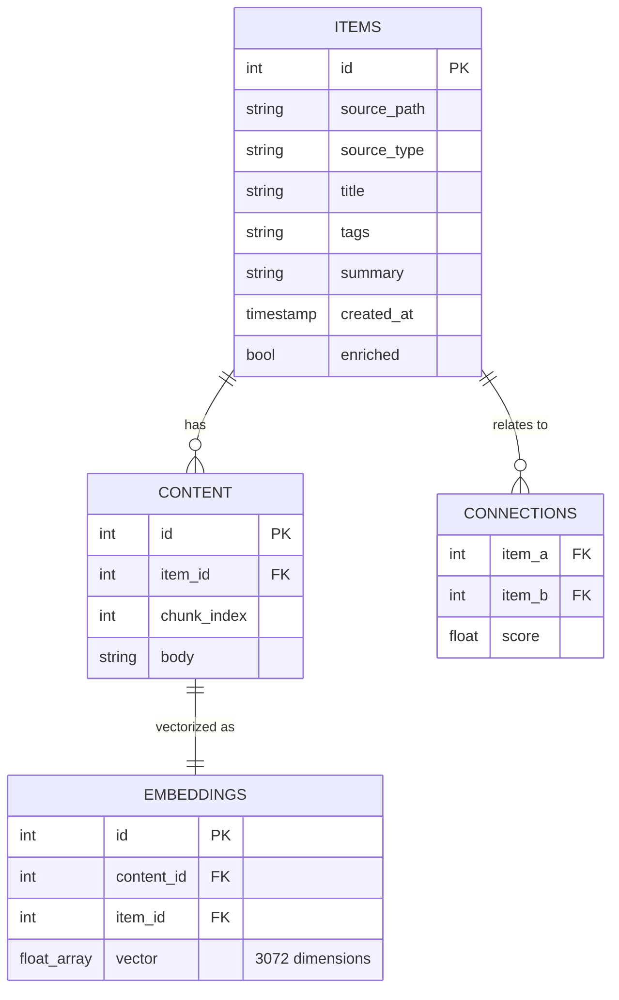

# Black Vault — Technical Documentation

Black Vault is designed as a local-first, intelligence-augmented file storage system. This document explains the internal mechanics of the MVP.

## 1. Architecture Overview

Black Vault uses a strictly decoupled **Two-Layer Architecture**:

### Interface Layer ([cli.py](file:///home/hulio/HackUDC26/hackudc/src/cli.py))
- **Responsibility**: User interaction, command parsing, and result formatting.
- **Tech**: Built with `typer` (CLI structure) and [rich](file:///home/hulio/HackUDC26/hackudc/src/backend/enrich.py#25-79) (UI formatting/tables).
- **Decoupling**: It never connects to DuckDB directly. It interacts purely with the `backend` package. This allows future ports to Tauri (GUI) or a FastAPI wrapper without changing the core processor.

### Processor Layer (`backend/`)
- **Responsibility**: The "brain" of the application. Handles ingestion, vectorization, enrichment, and searching.
- **Components**:
  - [ingest.py](file:///home/hulio/HackUDC26/hackudc/src/backend/ingest.py): Manages the data pipeline.
  - [db.py](file:///home/hulio/HackUDC26/hackudc/src/backend/db.py): Abstracted data access layer.
  - [search.py](file:///home/hulio/HackUDC26/hackudc/src/backend/search.py): Hybrid ranking engine.
  - [enrich.py](file:///home/hulio/HackUDC26/hackudc/src/backend/enrich.py): Local semantic augmentation (Ollama).
  - [connections.py](file:///home/hulio/HackUDC26/hackudc/src/backend/connections.py): Relationship discovery engine.
  - [log.py](file:///home/hulio/HackUDC26/hackudc/src/backend/log.py): Persistent logging toggle logic.

---

## 2. Ingestion Pipeline

When a file is "dropped" into the vault:

1. **Detection**: `python-magic` reads file headers to confirm the MIME type is `text/*`.
2. **Standardization**: Content is read and stored as UTF-8.
3. **Chunking**: `RecursiveCharacterTextSplitter` from LangChain breaks the text into 500-character segments with 100-character overlap to preserve context at the boundaries.
4. **Vectorization**: The `google-genai` SDK sends chunks to `gemini-embedding-001`. Each chunk returns a **3072-dimension** vector.
5. **Atomic Storage**: The item metadata, text chunks, and vector embeddings are stored within a single DuckDB transaction.

---

## 3. Data Model (DuckDB)

Black Vault persists everything in a single `.duckdb` file.

---

## 4. Hybrid Search Engine

Black Vault performs **Hybrid Search** by combining two distinct scoring strategies:

### Semantic Ranking (70% weight)
Uses the **DuckDB-VSS** extension to perform an HNSW (Hierarchical Navigable Small World) vector search.
- **Distance Metric**: Cosine Similarity.
- **Precision**: Handles conceptual matches (e.g., search "programación" finds files about "Python").

### Lexical Ranking (30% weight)
Uses standard SQL `ILIKE` operators to find exact keyword matches across text chunks.
- **Precision**: Handles specific terms, names, or IDs that embeddings might overlook.

### Fusion
Results are combined and deduplicated at the `item_id` level. A final weighted score is computed, and the system returns the top-ranked unique items.

---

## 5. Intelligence Pipeline (LLM)

After ingestion, the system triggers two "background" (inline for MVP) processes:

### Enrichment ([enrich.py](file:///home/hulio/HackUDC26/hackudc/src/backend/enrich.py))
Calls a local Ollama instance running `llama3.2` via HTTP. The model processes each chunk and returns a structured JSON metadata block for each. Finally, the system aggregates these to establish:
- A human-readable **Title**.
- Relevant **Tags** for filtering.
- A concise **Summary**.

### Operations Tracking ([log.py](file:///home/hulio/HackUDC26/hackudc/src/backend/log.py))
- Provides a persistent file logging mechanism. 
- When enabled via `logstart` command, all CLI activities are timestamped and recorded in `blackvault.log`.

### Relationship Discovery ([connections.py](file:///home/hulio/HackUDC26/hackudc/src/backend/connections.py))
- Computes a **Mean Embedding** for the entire document (averaging its chunks).
- Compares it against all other Mean Embeddings in the vault using Cosine Similarity.
- If similarity > **0.75**, a connection is recorded. This powers the "See related items" feature without manual linking.
